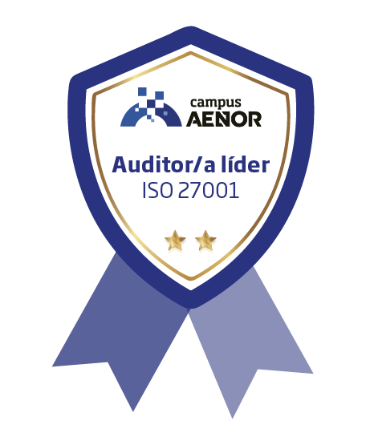

# 💼 ISO 27001 Lead Auditor Framework & Toolkit

Bienvenid@ a mi entorno personal de auditoría. Este repositorio es un **Framework de Evaluación y Toolkit de Recursos Técnicos** orientado a la planificación, ejecución y documentación de auditorías bajo los estándares **ISO 27001:2022** e **ISO 19011**.

> **Estado del Toolkit:**
> * **Módulos de Auditoría:** 4/4 operativos.
> * **Documentación de Campo:** Centralizada en el Centro de Plantillas.
> * **Última actualización:** 2026-06-21
>
> **[👉 ACCEDER AL DASHBOARD (SoA) - MATRIZ DE AUDITORÍA](./Dashboard-SoA.md)**

---

## 🏛️ Estructura del Framework

### 01. Gobernanza y Estrategia (Cláusulas 4 a 10)
*Mis guías de evaluación para las cláusulas obligatorias de la norma ISO 27001.*

| Módulo de Auditoría | Cláusula | Foco de Revisión (Mis notas) |
| :--- | :---: | :--- |
| [Contexto y Alcance](./01-Gobernanza-y-Estrategia/04-Contexto-y-Alcance/index.md) | 4 | Límites del SGSI y partes interesadas. |
| [Liderazgo](./01-Gobernanza-y-Estrategia/05-Liderazgo/index.md) | 5 | Compromiso directivo, política y roles. |
| [Planificación](./01-Gobernanza-y-Estrategia/06-Planificacion/index.md) | 6 | Riesgos, oportunidades y objetivos. |
| [Soporte](./01-Gobernanza-y-Estrategia/07-Soporte/index.md) | 7 | Recursos, concienciación y control documental. |
| [Operación](./01-Gobernanza-y-Estrategia/08-Operacion/index.md) | 8 | Apreciación y tratamiento del riesgo operativo. |
| [Evaluación del Desempeño](./01-Gobernanza-y-Estrategia/09-Evaluacion-Desempeno/index.md) | 9 | Medición, auditoría interna y revisión directiva. |
| [Mejora](./01-Gobernanza-y-Estrategia/10-Mejora/index.md) | 10 | No conformidades y mejora continua. |

### 02. Criterios Anexo A (Los 93 Controles)
*Despliegue operativo y evidencias técnicas por bloque normativo.*

| Bloque Normativo | Controles | Foco de Revisión Técnica |
| :--- | :---: | :--- |
| [Organizativos](./02-Criterios-Anexo-A/5-Controles-Organizativos/) | 37 | Gobernanza, proveedores, incidentes y continuidad. |
| [Personas](./02-Criterios-Anexo-A/6-Controles-Personas/) | 8 | Ciclo de vida del personal y concienciación. |
| [Físicos](./02-Criterios-Anexo-A/7-Controles-Fisicos/) | 14 | Seguridad perimetral y protección de activos físicos. |
| [Tecnológicos](./02-Criterios-Anexo-A/8-Controles-Tecnologicos/) | 34 | Seguridad lógica, criptografía y redes. |

### 03. Plantillas y Toolkits de Campo
*Documentación maestra estandarizada para el trabajo del auditor.*

| Herramienta | Uso Principal |
| :--- | :--- |
| [**📁 Centro de Plantillas**](./03-Plantillas-y-Toolkits/) | Acceso al catálogo completo de SOPs, modelos de informe y registros de hallazgos. |

---

## 📬 Contacto & Credenciales

[LinkedIn](https://www.linkedin.com/in/juan-jesus-ramos-sosa)   

